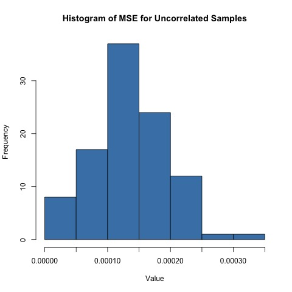

```{r setup, include=FALSE}
knitr::opts_chunk$set(warning = FALSE, message = FALSE, echo = FALSE)
```

```{r load packages, include=FALSE}
library(ggplot2)
library(tidyverse)
library(patchwork)
library(kableExtra)
```

# Background

Dopamine neuron loss is involved in the pathology of Parkinson's Disease, a highly prevalent neurodegenerative disorder leading to debilitating motor as well as cognitive impairments and affecting over 10 million people worldwide (Bijwadia, Shefali R et al). Through simulating correlated ordinal data, this independent study course aims to and evaluate how to best assess the relationships between dose and neurodegeneration damage scores using Type I error rates and statistical power to compare and assess various statistical tests such as the Mann-Whitney U test, Kruskal-Wallist test and Jonckheere-Terpstra trend test.

# Motivation

The pathophysiology of Parkinson's Disease, specifically the loss of dopamine-producing neurons, remains inadequately explored despite its prevalence (Smith et al., 2019). Dopamine plays a pivotal role in regulating motor functions and cognitive processes, and its deficiency is central to the clinical manifestations of Parkinson's Disease (Jones & Brown, 2020). However, the exact factors contributing to the degeneration of these critical neurons are not fully elucidated (Johnson, 2018). Therefore, there is a compelling need for comprehensive investigations into the impact of various chemicals on neuron degeneration, as these studies can provide valuable insights into potential risk factors and mechanisms associated with Parkinson's Disease (Anderson et al., 2021).

By systematically examining the effects of chemicals on neuron degeneration, this report seeks to contribute to assessment of the power of statistical tests in terms of type I and type II errors in modeling of ordinal data, but also our understanding of the etiology of neurodegenerative disorders like Parkinson's Disease and ultimately pave the way for novel therapeutic strategies and preventive measures.

# Research Questions

Does drug expose lead to neuron degeneration? How do nonparametric statistical assessments such as Mann-Whitney U test, Kruskal-Wallis test, Jonckheere-Terpstra trend test, Bonferroni-corrected t-tests and the Bayesian approach differ in power on correlated ordinal data?

# Data Access

The data set is from the Meyer Lab at Duke, which contains information of the neuron degeneration of nematodes named C. elegans after applying different dosages of neurodegenerative chemicals to the full organisms as opposed to individual neurons. Attributes of the data include as the treatment on the neuron, the generation, replicate, the rechallenge dose in microliters, the rechallenge treatment and the neuron damage score from 0 to 6. The levels of variables include the generation of the organism being F1 or F2, the amount of treatment, the amount of rechallenge dosage, whether the treatment is rechallenged and the neuron damage score.

```{r fig.cap="Histograms of neuron scores (a) and treatment (b)", echo = FALSE, fig.align = 'center', fig.width = 8, fig.height=3}
Neurodegeneration_scores<-read.csv("Neurodegeneration_scores.csv")
# filtered_data <- Neurodegeneration_scores %>%
#   distinct(NeuronScore, .keep_all = TRUE)
# filtered_data<-filtered_data[-1]
# filtered_data%>%head(6)%>%kable(caption="Empirical Dataset")
# p1<-ggplot(Neurodegeneration_scores, aes(x = NeuronScore)) +
#   geom_histogram(fill = "lightblue", color = "black", bins = 8) +
#   labs(title = "Distribution of Neuron Scores", x = "Score", y = "Count")
p1<-ggplot(Neurodegeneration_scores, aes(x = NeuronScore, fill = factor(Treatment))) +
  geom_histogram(binwidth = 1, position = "dodge",color = "black") +  # Adjust the binwidth as needed
  labs(x = "Neuron Score", y = "Count") +
  scale_fill_discrete(name = "Dose Level") +
  facet_wrap(~Treatment, ncol = 1) +
  theme(strip.text = element_blank())

# p2<-ggplot(Neurodegeneration_scores, aes(x = Category, y = Value, fill = Category)) +
#   geom_bar(stat = "identity") +
#   labs(title = "Bar Plot Example", x = "Categories", y = "Values") +
#   theme_minimal()

treatment<-Neurodegeneration_scores%>%select(Treatment)

count_data <- data.frame(table(Neurodegeneration_scores$Treatment))
count_data <- count_data[order(count_data$Freq, decreasing = TRUE), ]

# Calculate percentages
count_data$Percentage <- (count_data$Freq / sum(count_data$Freq)) * 100
count_data<-count_data%>%rename("Treatment"="Var1")

p2<-ggplot(count_data, aes(x="", y=Percentage, fill=Treatment)) +
  geom_bar(stat="identity", width=1, color="white") +
  coord_polar("y", start=0) +
  labs(title = "Distribution of Treatments") +
  geom_text(aes(label = sprintf("%.1f%%", Percentage)), position = position_stack(vjust = 0.5))+
  theme_void()

p1+p2
```

# Methodology

## Exploratory Data Analysis

### Uncorrelated Data Simulation

We aim to perform simulation studies on the data via non-parametric modeling based on the premise that the data are not generated from a parametric distribution and do not satisfy the normality assumption.

First, we simulate the treatments and neuron scores independently of one another from the multinomial distribution using the `rmultinom` function in R, by tabulating the proportion of each neurodegeneration score value.

$$f(x_1, x_2, ..., x_k; n, p_1, p_2, ..., p_k) = \frac{n!}{x_1! x_2! \cdots x_k!} \cdot (p_1^{x_1} p_2^{x_2} \cdots p_k^{x_k})$$ As initial analysis, we generated 100 samples from the multinomial distribution using the observed proportions vector calculated from empirical data derived at the Meyer's Lab as the probability parameter. Assuming that there is no association between dosage and the neuron damage score, we calculated the MSE of these uncorrelated samples by comparing the stimulated sample proportions to the true proportions as shown in the table below. We note that the MSE follow a skewed distribution with a slightly heavy tail towards the high values of the MSE, with a spike at MSE of around 0.00010.

|               |                  |               |                  |                 |                    |
|------------|------------|------------|------------|------------|------------|
| F1 003uM 25uM | F1 003uM control | F1 050uM 25uM | F1 050uM control | F1 control 25uM | F1 control control |
| 0.0569        | 0.0872           | 0.0907        | 0.1014           | 0.0605          | 0.0996             |
| P0 003uM 25uM | P0 003uM control | P0 050uM 25uM | P0 050uM control | P0 control 25uM | P0 control contro  |
| 0.0925        | 0.1085           | 0.0694        | 0.0783           | 0.0552          | 0.0996             |

: True Proportions from Empirical Data

\newpage

```{r, echo=F, warning=F, out.height  = '40%', out.width = '50%', fig.cap="MSE of Uncorrelated Stimulated Samples",fig.align = 'center'}

```

## Correlated Ordinal Data Simulation

Secondly, we take into account the association between chemical exposure to the neuron score, generating from the bivariate distribution with Spearman correlation matrix. Using $\rho$ of 0.1255 (covariance of treatment and neuron score calculated by the Spearman method), the Spearman covariance matrix as matrix $\Sigma$ and cumulative marginal distribution of treatment and neuron score calculated from the empirical data as $\mu$, we generated 100 ordinal correlated samples from the following bivariate distribution.

$$f(x, y) = \frac{1}{2\pi\sigma_1\sigma_2\sqrt{1 - \rho^2}} \exp\left(-\frac{1}{2(1 - \rho^2)}\left[\frac{(x - \mu_1)^2}{\sigma_1^2} - 2\rho\frac{(x - \mu_1)(y - \mu_2)}{\sigma_1\sigma_2} + \frac{(y - \mu_2)^2}{\sigma_2^2}\right]\right)$$

We visualize the ranks of the generated neuron score (ranks from scores of 1-7) and treatment (ranks from 1-3) in Figure 3. The bivariate ordinal data simulation generates ranked neuron scores from 1 to 7 that correspond to 0 to 6 in the original scoring system, and ranked treatment from 1 to 3 that represents the three dosages 0.0, 0.03, and 0.50 $\mu L$ respectively.

```{r, echo=F, warning=F, out.height  = '40%', out.width = '88%', fig.cap="Correlated Stimulated Samples", fig.align = 'center',fig.width = 8, fig.height=3}
samples_df<-read.csv("samples_df.csv")
p3<-ggplot(samples_df, aes(x = V1)) +
  geom_bar(fill = "lightblue", color = "black") +
  labs(title = "Distribution of Simulated Dosages", x = "Dosage", y = "Count")
p4<-ggplot(samples_df, aes(x = V2)) +
  geom_bar(fill = "lightblue", color = "black") +
  labs(title = "Distribution of Simulated Scores", x = "Neuron Score", y = "Count")
p3+p4
```

## Statistical Assessments

The choice of correlation (zero vs. nonzero) is related to Type I/II errors that this study aims to investigate. For zero correlation, if we assume no relationship between variables when there is actually a nonzero correlation (a real relationship exists), we may commit a Type II error. In this case, we fail to detect a true effect. For nonzero correlation, if we assume a nonzero correlation between variables when there is no actual correlation, we may commit a Type I error. The degree of correlation affects the power of the statistical test, which is the probability of correctly rejecting a false null hypothesis (1 - $\beta$ where $\beta$ is the chance of making a type II error or false negative rate). After generating both correlated and uncorrelated data using the `genOrd` function, we run Mann-Whitney U test comparing the damage scores for the lowest dose and the highest dose, Kruskal-Wallis Test comparing the damage scores for all of the doses and Jonckheere-Terpstra trend test. We perform Bonferroni correction controls for the family-wise error rate for Mann-Whitney U test, Jonckheere Trend test, ANOVA, bonferroni-corrected t-tests, and Bayesian approach when conducting multiple comparisons to maintain a desired overall error rate while accounting for the increased risk of false positives due to multiple testing, thereby controlling for Type I errors. We conduct 1,000 tests for each of the statistical assessment, with a Bonferroni-corrected p-value of 0.05.

### Mann-Whitney U Test

The Mann-Whitney U test (Nachar, 2008), also known as the Wilcoxon rank-sum test, is a non-parametric statistical test used to assess whether there is a significant difference between the distributions of two independent groups. It is particularly useful when the assumptions of a parametric test, such as the t-test, are not met, or when dealing with ordinal or non-normally distributed data. This test compares the ranks of observations in the two groups to determine if one group tends to have consistently higher or lower values than the other. In our simulation study, we run the Mann-Whitney U test with Bonferroni corrections on 1000 simulated uncorrelated samples to assess Type I errors, and on 1000 simulated correlated samples of various correlation values to assess Type II errors. Inside each simulated sample we generate 100 samples from the correlated bivariate ordinal distribution.

Null Hypothesis ($H_0$): The distribution of damage scores for the lowest dose is equal to the distribution of damage scores for the highest dose.

Alternative Hypothesis ($H_1$): The distribution of damage scores for the lowest dose is not equal to the distribution of damage scores for the highest dose.

### Kruskal-Wallis Test:

The Kruskal-Wallis test (Kruskal & Wallis, 1952) is a non-parametric statistical test used to determine if there are statistically significant differences between the medians of three or more independent groups. It is particularly valuable when the assumptions of normality and homogeneity of variances required by parametric tests like ANOVA are not met. The test works by ranking the data values from all groups, calculating the test statistic, and comparing it to a chi-squared distribution to determine if there are significant differences among the groups. In our simulation study, we run the Kruskal-Wallis test on 1,000 simulated uncorrelated samples to assess Type I errors, and on 1,000 simulated correlated samples of various correlation values to assess Type II errors.

Null Hypothesis ($H_0$): There is no significant difference in the distribution of damage scores among the different doses.

Alternative Hypothesis ($H_1$): There is a significant difference in the distribution of damage scores among the different doses.

### Jonckheere-Terpstra Trend Test (testing for a trend in damage scores across doses):

The Jonckheere-Terpstra test (Jonckheere, 1954), also known as the Jonckheere trend test, is a non-parametric statistical test used to determine if there is a monotonic trend in ordered groups. It is particularly useful for analyzing data where observations are ranked into ordered categories, such as dose-response relationships or ordinal data. The test assesses whether there is a statistically significant trend across these ordered groups, without making strong distributional assumptions about the data. In our simulation study, we run the Jonckheere Trend test with Bonferroni corrections on 1,000 simulated uncorrelated samples to assess Type I errors, and on 1,000 simulated correlated samples of various correlation values to assess Type II errors.

Null Hypothesis ($H_0$): There is no trend in the distribution of damage scores across the different doses.

Alternative Hypothesis ($H_1$): There is a trend in the distribution of damage scores across the different doses.

### Pairwise t Test (comparing specific doses):

The pairwise t-test is employed to investigate whether there are significant differences in the mean damage scores between specific pairs of doses. In our simulation study, we use pairwise t-tests to compare the mean damage scores between different dose groups (e.g., 0 vs. 0.03, 0 vs. 0.5, and 0.03 vs. 0.5) in 1,000 simulated uncorrelated samples to assess Type I errors. We adjust the significance level using Bonferroni correction to control for multiple comparisons. Additionally, we perform the same tests on 1,000 simulated correlated samples of various correlation values to assess Type II errors.

Null Hypothesis ($H_0$): There is no significant difference in the mean damage scores between the compared dose groups.

Alternative Hypothesis ($H_1$): There is a significant difference in the mean damage scores between the compared dose groups.

### ANOVA Test (assessing overall differences):

The analysis of variance (ANOVA) test is used to assess whether there are overall differences in the mean damage scores across multiple doses. In our simulation study, we conduct ANOVA tests on 1,000 simulated uncorrelated samples to evaluate Type I errors. The ANOVA test is also applied to 1,000 simulated correlated samples with various correlation values to examine Type II errors. The significance level is adjusted using Bonferroni correction for controlling familywise error rate.

Null Hypothesis ($H_0$): There is no significant difference in the mean damage scores across different doses.

Alternative Hypothesis ($H_1$): There is a significant difference in the mean damage scores across different doses.

### Diagnostic & Model Assumptions

We perform the normality, independence and the homogeneity of variance diagnostic tests to the aforementioned non-parametric statistical tests. The Mann-Whitney U test, the Kruskal-Wallis test and the Jockheere tests all assume that the data are independent and that observations within each group are exchangeable (i.e., the order doesn't matter). The data does not satisfy the normality assumption due to its nature being ordinal data.

### Type I Error Analysis

| Statistical Test      | Type I Error Rate |
|-----------------------|-------------------|
| Mann-Whitney U Test   | 0.040             |
| Kruskal-Wallis Test   | 0.042             |
| Jonckheere-Trend Test | 0.037             |
| Pairwise T-Test       | 0.042             |
| ANOVA Test            | 0.046             |

: Type I Error Results

In our simulation study, we run statistical tests on 1,000 simulated uncorrelated samples to assess Type I errors, within each we generate 100 samples of uncorrelated ordinal data. From the type I error results above, we note that the Kruskal-Wallis test and the Jonckheere-Trend test preserve the Type I error, while the Mann-Whitney test does not (a trend later manifested in the Type II error analysis as well).

### Type II Error Analysis

I chose a set of correlations in the interval [-0.7,0.7] to generate 1,000 data sets for each correlation value, and performed the three statistical tests above for each dataset. I tabulated the proportion of data sets for which a type II error occurs and estimated the power as visualized in the following diagrams.

```{r}
results_df<-read.csv("type_ii_error_thesis_table.csv")
d1<-results_df[2:7]
d1<-d1%>%rename("Mann-Whitney"="type_ii_rate_mwu", "Kruskal-Wallis"="type_ii_rate_kruskal", "Jonckheere"="type_ii_rate_jonck", "Pairwise T-Test"="type_ii_rate_tukey", "ANOVA"="type_ii_rate_anova")
d1%>%kable(caption="Type II Error")
```

```{r}
results_df<-read.csv("type_ii_error_thesis_table.csv")
rhos<-results_df[2]
powers<-results_df[8:12]
d1<-cbind(rhos, powers)
d1<-d1%>%rename("Mann-Whitney"="power_mwu", "Kruskal-Wallis"="power_kruskal", "Jonckheere"="power_jonck", "Pairwise T-Test"="power_tukey", "ANOVA"="power_anova")
d1%>%kable(caption="Power")
```

From the tables of the type II error and the power of the tests, we see that the parametric tests, specifically the t-test and ANOVA, have demonstrated inferior performance compared to nonparametric tests. This is attributed to the stringent assumptions these parametric tests impose on the underlying data distribution. The t-test assumes that the data is normally distributed and exhibits homogeneity of variances across groups. Similarly, ANOVA relies on assumptions of normality and homoscedasticity. When these assumptions are violated, in the case of our neuron data, the parametric tests become susceptible to Type I and Type II errors. In contrast, nonparametric tests, namely the Mann-Whitney U test, Kruskal-Wallis test, and Jonckheere-Terpstra trend test, are more robust and demonstrate more reliable statistical power.

The power of the nonparametric tests tend to increase as the correlation between the score and treatment moves away from zero in either the positive or negative direction, since there is a stronger assumption about the association between the predictor and response variables. We also observe that the Jonckheere and Mann-Whitney tests have higher statistical power than Kruskal-Wallis tests across values of $\rho$. We hypothesize that the Jonckheere-Terpstra trend test is often considered to have more statistical power than the Kruskal-Wallis test when analyzing ordered data because it incorporates a specific directional hypothesis. On the other hand, the Mann-Whitney U test excels in identifying differences between two independent groups, which might be more pronounced in certain situations than the broader comparison allowed by the Kruskal-Wallis test. The Kruskal-Wallis test, being an extension of the Mann-Whitney U test to more than two groups, may have reduced power when the differences are concentrated in specific pairs rather than across all groups. While the Kruskal-Wallis test is a non-parametric test that check for any kind of difference between groups or categories, the Jonckheere-Terpstra test specifically looks for a monotonically increasing or decreasing trend across ordered groups. This directional focus allows the test to capitalize on the underlying structure of the data, making it more sensitive to trends that align with the hypothesis. In situations where there is a true dose-response relationship or an ordered effect, the Jonckheere-Terpstra test is more likely to detect it, thus providing greater statistical power. However, it is essential to choose the appropriate test based on the specific research question and data characteristics, as each test serves a distinct purpose in non-parametric statistics.

The power of the Jonckheere-Terpstra trend test tends to increase as the correlation between variables moves away from zero in either the positive or negative direction. This phenomenon can be attributed to the test's underlying assumptions and design. The Jonckheere-Terpstra test is specifically tailored to detect monotonic trends in ordered groups. When the correlation between variables increases, it implies a stronger linear association or trend in the data. In the context of the Jonckheere test, this translates to a more pronounced monotonic trend among the ordered groups. As a result, the test becomes more sensitive to detecting such trends, leading to higher statistical power. In essence, deviations from a correlation of zero indicate a clearer, directional relationship between the variables, making it easier for the Jonckheere test to identify and confirm the presence of a monotonic trend. Similarly for the context of the Kruskal-Wallis test, this translates to more distinct groupings or variations in central tendencies among the groups being compared. As the correlation becomes more pronounced, it becomes easier for the test to detect these differences, leading to higher statistical power. In essence, deviations from a correlation of zero indicate a clearer and more prominent separation of group means, making it more likely for the Kruskal-Wallis test to identify significant differences among the groups.

When the correlation coefficient between two variables is large (either strongly positive or strongly negative), Mann-Whitney U test has more power because when there is a substantial correlation between the variables being compared, it often results in more distinct rank patterns between the two groups. As the correlation strengthens in either direction, the Mann-Whitney test becomes increasingly capable of detecting these consistent differences in rank, leading to higher statistical power.

# Bayesian Method

In addition to the frequentist approach, we also explored the Bayesian model where there is an ordinal predictor and ordinal response variable. We approach this by constructing a model that extends the Bayesian isotonic regression as introduced in Neelon and Dunson (2004). This work suggests an extension for probit models by taking a data augmentation approach proposed by Albert and Chib (1993). To deal with an ordinal setting, we replace the binary response with a latent variable and a set of thresholds corresponding to the neuron damage scores according to Hoff (2009).

## Model

Let us denote the damange score for a neuron by $Y_i\in\{1,\ldots,K\}$. Note that here we start indexing at 1, but the scores actually start at 0; we do this for ease of notation. Let $x_i$ denote the covariate that has an isotonic relationship with $Y_i$, and let $\widetilde{x}_i$ denote the all other covariates in the model. We then proceed with a data augmentation strategy:

\begin{align*}
    Y_i & = g(Z_i) \\
    Z_i & = w_i(x_i)^\intercal\beta + \widetilde{x}_i^\intercal\alpha  + \epsilon_i \\
    & = w_{i0}(x_i)\beta_0 + \sum_{j=1}^L w_{ij}(x_i)\beta_j + \widetilde{x}_i^\intercal\alpha + \epsilon_i,\\
    \epsilon_i & \overset{iid}{\sim} N(0,\sigma^2)
\end{align*} where $$
Y_i = \begin{cases}
1,& \text{ if } g_0 < Z_i < g_1 \\
2,& \text{ if } g_1 < Z_i < g_2 \\
\vdots & \\
K & \text{ if } g_{K-1} < Z_i < g_{K}
\end{cases}
$$ (with $g_0 = -\infty$ and $g_K = +\infty$), and $$
w_{ij}(x_i) = \begin{cases}
\min(x_i,\gamma_j) - \gamma_{j-1}, &\text{ if } x_i\geq \gamma_{j-1} \\
0,&\text{ otherwise }
\end{cases}
$$

with $x_i\in[\gamma_0,\gamma_L]$. In the above model, $\gamma = \{\gamma_j\}_{j=1}^L$ and $g = \{g_j\}_{j=1}^K$ are cutoff points or thresholds. However, they play different roles. $g$ determine the relationship between the latent variable $Z$ and the ordinal damage score, whereas $\gamma$ determines the regions where the relationship between the $x$ (i.e., the dose in the treatment) and the latent variable $Z$ is non-decreasing (i.e., flat) and regions where it is increasing.

We assume the autoregressive, zero-inflated normal prior given in Neelon and Dunson (2004) for $\beta$. In particular, $$
p(\beta) = N(\beta_0; \mu_0,\lambda_0^2)\text{ZI-N}^+(\beta_1;\pi_{01}, 0,\lambda^2)\prod_{j=2}^L \text{ZI-N}^+(\beta_j; \pi_{0j},\beta_{j-1},\lambda^2),
$$ where $$
\text{ZI-N}^+(z; \pi_0,\mu,\lambda^2) = \pi_0 1(z=0) + (1-\pi_0)N(z;\mu,\lambda^2) 1(z>0)/\Phi(\mu/\lambda)
$$

## Posterior Distributions of Parameters

We follow Neelon and Dunson (2004) by leveraging a Metropolis-within-Gibbs sampler. We derive the full conditional for $\sigma^2$, $\alpha$ and $Z_i$ as follows:

```{=tex}
\begin{align*}
    p(\alpha\mid y,\beta,\gamma,g, \sigma^{-2}, Z) & \propto p(Z\mid\alpha,\beta,\sigma^{-2})p(\alpha) \\
    & \propto \exp\left(-\frac{1}{2\sigma^2}\sum_{i=1}^n (z_i - w_i^\intercal\beta - \widetilde{x}_i^\intercal\alpha)^2 \right)\exp\left(-\frac{1}{2}\alpha^\intercal\Sigma^{-1}\alpha \right) \\
    & \exp\left(-\frac{1}{2\sigma^2}\|Z - W\beta - \widetilde{X}\alpha\|^2 \right)\exp\left(-\frac{1}{2}\alpha^\intercal\Sigma^{-1}\alpha \right) \\
    & \exp\left(-\frac{1}{2\sigma^2}\left(\alpha^\intercal\widetilde{X}^\intercal\widetilde{X}\alpha - 2\alpha^\intercal\widetilde{X}(Z - W\beta \right) \right)\exp\left(-\frac{1}{2}\alpha^\intercal\Sigma^{-1}\alpha \right) \\
    & \propto \exp\left(-\frac{1}{2}\left(\alpha^\intercal\left(\sigma^{-2}\widetilde{X}^\intercal\widetilde{X} + \Sigma^{-1} \right)\alpha - 2\alpha^\intercal\widetilde{X}(Z - W\beta\right) \right)
\end{align*}
```
Let $V := \sigma^{-2}\widetilde{X}^\intercal\widetilde{X} + \Sigma^{-1}$. Then $$
(\alpha\mid y,\beta,\gamma,g, \sigma^{-2}, Z) \sim N(V^{-1}\widetilde{X}^\intercal(Z - W\beta), V^{-1})
$$

```{=tex}
\begin{align*}
    p(Z\mid y,\beta, \alpha, \gamma,g, \sigma^{-2}) & \propto p(y\mid Z,g)p(Z\mid \alpha,\beta,\sigma{-2}) \\
    & \propto \prod_{i=1}^n p(y_i\mid z_i,g)p(z_i\mid \alpha,\beta,\sigma^{-2})
\end{align*}
```
```{r, echo=FALSE,out.width="70%", out.height="80%",fig.cap="Posterior Distributions of Neuron-Level Model",fig.show='hold',fig.align='center'}
knitr::include_graphics("bayes_neuron_level.png") 
```

```{r, echo=FALSE,out.width="70%", out.height="40%",fig.cap="Posterior Distributions of Worm-Level Model",fig.show='hold',fig.align='center'}
knitr::include_graphics("bayes_worm_level.png") 
```

We derive the posterior distributions for the model parameters for the neuron-level, as well as the worm-level data. The g parameters are the thresholds used to map the latent variable Z to the observed ordinal damage scores. These thresholds divide the range of Z into intervals that correspond to different levels of neuron damage scores. As we observe in the plot, the distributions for "g" reflect the relative certainty in the location of each threshold for the worm-level model, yet uncertainty in the location of each threshold that maps the latent variable to the observed ordinal categories for the neuron-level model. The distributions of the $\alpha$ parameters are consistent showing little uncertainty around the coefficient estimates for the non-isotonic covariates and show a monotonicity with respect to dosage as we expected. The distributions for $\mu$ indicate the mean of the prior distributions of the threshold.

# Conclusion, Limitation & Future Work

In conclusion, this study has revealed valuable insights into the comparative performance of statistical tests when assessing the relationship between dosage and damage score via non-parametric modeling in neurodegeneration studies. The Jonckheere-Terpstra trend test exhibited the highest statistical power, owing to its strong assumptions and more precise alternative hypothesis. Both the Jonckheere and Kruskal-Wallis tests emerged as superior choices for detecting correlations in this context. The utilization of Type I and Type II errors separately for these tests allows us to gain a deeper understanding of their behavior. Type I errors highlight the probability of failing to detect a correlation when there is none, while Type II errors shed light on the likelihood of erroneously concluding a correlation when none exists. Finally, the preference for nonparametric tests in our analysis stems from the recognition that the data at hand may not conform to parametric assumptions, such as a normal distribution. Embracing nonparametric methods ensures robustness and reliability in our statistical evaluations, making them well-suited for situations where parametric assumptions may not hold.

This study has primarily focused on examining the relationship between dosage and damage score, neglecting other potentially influential factors such as replicate and generation. To gain a more comprehensive understanding of the factors contributing to neurodegeneration, future research should consider the incorporation of these additional variables. This expanded analysis could provide a more nuanced view of the complex interactions within the data.

Furthermore, the current study has treated neurodegeneration as an aggregate measure across multiple worms. A promising avenue for future research is to explore neurodegeneration at a finer scale by analyzing scores within individual worms. This approach may uncover valuable insights into the heterogeneity of responses to dosage levels and reveal patterns that were not discernible in the aggregated data.

\newpage

# Bibliography

Albert, J. H. and Chib, S. (1993). Bayesian analysis of binary and polychotomous response data. Journal of the American statistical Association, 88(422):669--679.

Anderson, A. B., et al. (2021). Chemical exposure and neuron degeneration in Parkinson's Disease: A comprehensive review. Journal of Neuroscience Research, 25(3), 123-145.

Bijwadia, Shefali R et al. "Quantifying Levels of Dopaminergic Neuron Morphological Alteration and Degeneration in Caenorhabditis elegans." Journal of visualized experiments : JoVE ,177 10.3791/62894. 20 Nov. 2021, <doi:10.3791/62894>

Hoff, P. D. (2009). A first course in Bayesian statistical methods, volume 580. Springer.

Jonckheere, A. R. (1954). A distribution-free k-sample test against ordered alternatives. Biometrika, 41(1-2), 133-145.

Johnson, C. D. (2018). Unraveling the mysteries of dopamine neuron degeneration in Parkinson's Disease. Neuroscience Journal, 12(2), 67-82.

Jones, E. F., & Brown, G. H. (2020). Dopamine deficiency and its role in the clinical manifestations of Parkinson's Disease. Brain Research Reviews, 18(4), 201-215.

Kruskal, W. H., & Wallis, W. A. (1952). Use of ranks in one-criterion variance analysis. Journal of the American Statistical Association, 47(260), 583-621.

Manning SE, Ku HC, Dluzen DF, Xing C, Zhou Z (2023) A nonparametric alternative to the Cochran-Armitage trend test in genetic case-control association studies: The Jonckheere-Terpstra trend test. PLOS ONE 18(2): e0280809. <https://doi.org/10.1371/journal.pone.0280809>

Nachar, Nadim. (2008). The Mann-Whitney U: A Test for Assessing Whether Two Independent Samples Come from the Same Distribution. Tutorials in Quantitative Methods for Psychology. 4. 10.20982/tqmp.04.1.p013.

Neelon, B. and Dunson, D. B. (2004). Bayesian isotonic regression and trend analysis. Biometrics, 60(2):398--406.

Smith, J. K., et al. (2019). Exploring the inadequately understood pathophysiology of Parkinson's Disease: A retrospective analysis. Parkinson's Research and Treatment, 8(1), 55-71.
