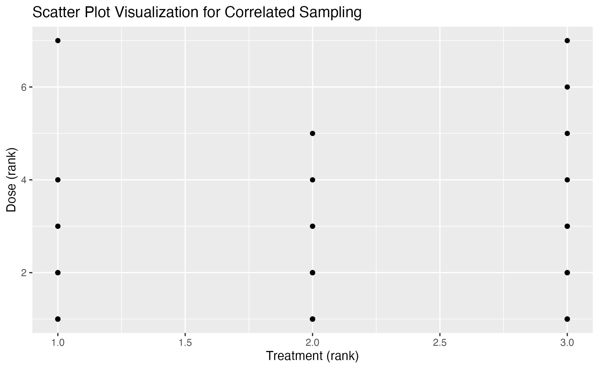
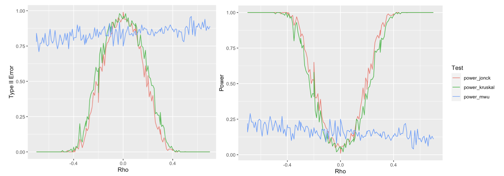

```{r setup, include=FALSE}
knitr::opts_chunk$set(warning = FALSE, message = FALSE, echo = FALSE) 
```

```{r load packages, include=FALSE}
library(ggplot2)
library(tidyverse)
library(patchwork)
library(kableExtra)
```

# Background

Dopamine neuron loss is involved in the pathology of Parkinson's Disease, a highly prevalent neurodegenerative disorder leading to debilitating motor as well as cognitive impairments and affecting over 10 million people worldwide (Bijwadia, Shefali R et al). The neurobiologic data analysis of this disesase, dopaminergic neurodegeneration, however, is understudied. Through simulating correlated ordinal data, this independent study course aims to and evaluate how to best assess the relationships between dose and neurodegeneration damage scores using Type I error rates and statistical power to compare and assess various statistical tests such as the Mann-Whitney U test, Kruskal-Wallist test and Jonckheere-Terpstra trend test.

# Motivation

The pathophysiology of Parkinson's Disease, specifically the loss of dopamine-producing neurons, remains inadequately explored despite its prevalence. Dopamine plays a pivotal role in regulating motor functions and cognitive processes, and its deficiency is central to the clinical manifestations of Parkinson's Disease. However, the exact factors contributing to the degeneration of these critical neurons are not fully elucidated. Therefore, there is a compelling need for comprehensive investigations into the impact of various chemicals on neuron degeneration, as these studies can provide valuable insights into potential risk factors and mechanisms associated with Parkinson's Disease.

By systematically examining the effects of chemicals on neuron degeneration, this report seeks to contribute to assessment of the power of statistical tests in terms of type I and type II errors in non-parametric modeling of ordinal data, but also our understanding of the etiology of neurodegenerative disorders like Parkinson's Disease and ultimately pave the way for novel therapeutic strategies and preventive measures.

# Research Questions

Does drug expose lead to neuron degeneration? How do nonparametric statistical assessments such as Mann-Whitney U test, Kruskal-Wallis test and Jonckheere-Terpstra trend test differ in power on correlated ordinal data?

# Data Access

The data set is from the Meyer Lab at Duke, which contains information of the neuron degeneration of nematodes named C. elegans after applying different dosages of neurodegenerative chemicals. Attributes of the data include as the treatment on the neuron, the generation, replicate, the rechallenge dose in microliters, the rechallenge treatment and the neuron damage score. Replicate,Treatment_all,Generation,Treatment,Rechallenge_dose_uM,Rechallenge_Treatment,NeuronScore. The Github repository along with data is in the link as follows: <https://github.com/rpresman/neuron> Here we perform exploratory data analysis on the neuron degeneration scores:

```{r fig.cap="Histograms of neuron scores (a) and treatment (b)", echo = FALSE, fig.align = 'center', out.height="40%", out.width="88%"}
Neurodegeneration_perneuron_scores<-read.csv("Neurodegeneration_perneuron_scores.csv")
Neurodegeneration_scores<-read.csv("Neurodegeneration_scores.csv")

Neurodegeneration_scores[-1]%>%head()%>%kable()
p1<-ggplot(Neurodegeneration_scores, aes(x = NeuronScore)) +
  geom_histogram(fill = "lightblue", color = "black", bins = 6) +
  labs(title = "Histogram of Neuron Scores", x = "Score", y = "Count")
p2<-ggplot(Neurodegeneration_scores, aes(x = Treatment)) +
  geom_histogram(fill = "lightblue", color = "black") +
  labs(title = "Histogram of Treatment doses", x = "Score", y = "Count")
p1+p2
```

# Methodology

## Exploratory Data Analysis

### Uncorrelated Data Simulation

Since the data does not satisfy the normality assumption due to its nature being ordinal data, we aim to perform simulation studies on the data via non-parametric modeling.

First, we simulate the treatments and neuron scores independently of one another from the multinomial distribution using the `rmultinom` function in R, by tabulating the proportion of each neurodegeneration score value.

$$f(x_1, x_2, ..., x_k; n, p_1, p_2, ..., p_k) = \frac{n!}{x_1! x_2! \cdots x_k!} \cdot (p_1^{x_1} p_2^{x_2} \cdots p_k^{x_k})$$ As initial analysis, we generated 100 samples from the multinomial distribution using the true proportions vector as the probability parameter. Assuming that there is no association between dosage and the neuron damage score, we calculated the MSE of these uncorrelated samples as follows. We note that the MSE follow a skewed distribution with a slightly heavy tail towards the high values of the MSE, with a spike at MSE of around 0.00010.

```{r, echo=F, warning=F, out.height  = '40%', out.width = '50%', fig.cap="MSE of Uncorrelated Stimulated Samples",fig.align = 'center'}
knitr::include_graphics("histogram.jpeg")
```

## Correlated Ordinal Data Simulation

Secondly, we take into account the association between chemical exposure to the neuron score, generating from the bivariate distribution with Spearman correlation matrix. After calculating the marginal distributions for treatment and neuron score, we calculated the covariates using the Spearman method, and generated 100 ordinal correlated samples from the following bivariate distribution using the `genOrd` function:

$$f(x, y) = \frac{1}{2\pi\sigma_1\sigma_2\sqrt{1 - \rho^2}} \exp\left(-\frac{1}{2(1 - \rho^2)}\left[\frac{(x - \mu_1)^2}{\sigma_1^2} - 2\rho\frac{(x - \mu_1)(y - \mu_2)}{\sigma_1\sigma_2} + \frac{(y - \mu_2)^2}{\sigma_2^2}\right]\right)$$

```{r, echo=F, warning=F, out.height  = '40%', out.width = '60%', fig.cap="Ranks of Correlated Stimulated Samples", fig.align = 'center'}

```

We visualize the ranks of the generated treatment (ranks from scores of 1-7) and doses (ranks from 1-3 representing 0.0, 0.03, and 0.50 $\mu L$ respectively) in Figure 3.

## Statistical Assessments

The choice of correlation (zero vs. nonzero) is related to Type I/II errors that this study aims to investigate. For zero correlation, if we assume no relationship between variables when there is actually a nonzero correlation (a real relationship exists), we may commit a Type II error. In this case, we fail to detect a true effect. For nonzero correlation, if we assume a nonzero correlation between variables when there is no actual correlation, we may commit a Type I error. The choice of correlation affects the power of the statistical test, which is the probability of correctly rejecting a false null hypothesis (1 - $beta$). After generating both correlated and uncorrelated data using the `genOrd` function, we run Mann-Whitney U test comparing the damage scores for the lowest dose and the highest dose, Kruskal-Wallis Test comparing the damage scores for all of the doses and Jonckheere-Terpstra trend test. We perform Bonferroni correction controls for the family-wise error rate for Mann-Whitney U test and Jonckheere Trend test,when conducting multiple comparisons to maintain a desired overall error rate while accounting for the increased risk of false positives due to multiple testing, thereby controlling for Type I errors.

### Mann-Whitney U Test

The Mann-Whitney U test (Nachar, 2008), also known as the Wilcoxon rank-sum test, is a non-parametric statistical test used to assess whether there is a significant difference between the distributions of two independent groups. It is particularly useful when the assumptions of a parametric test, such as the t-test, are not met, or when dealing with ordinal or non-normally distributed data. This test compares the ranks of observations in the two groups to determine if one group tends to have consistently higher or lower values than the other. In our simulation study, we run the Mann-Whitney U test with Bonferroni corrections on 10,000 simulated uncorrelated samples to assess Type I errors, and on 10,000 simulated correlated samples of various correlation values to assess Type II errors.

Null Hypothesis ($H_0$): The distribution of damage scores for the lowest dose is equal to the distribution of damage scores for the highest dose.

Alternative Hypothesis ($H_1$): The distribution of damage scores for the lowest dose is not equal to the distribution of damage scores for the highest dose.


### Kruskal-Wallis Test:

The Kruskal-Wallis test (Kruskal & Wallis, 1952) is a non-parametric statistical test used to determine if there are statistically significant differences between the medians of three or more independent groups. It is particularly valuable when the assumptions of normality and homogeneity of variances required by parametric tests like ANOVA are not met. The test works by ranking the data values from all groups, calculating the test statistic, and comparing it to a chi-squared distribution to determine if there are significant differences among the groups. In our simulation study, we run the Kruskal-Wallis test on 10,000 simulated uncorrelated samples to assess Type I errors, and on 10,000 simulated correlated samples of various correlation values to assess Type II errors.

Null Hypothesis ($H_0$): There is no significant difference in the distribution of damage scores among the different doses.

Alternative Hypothesis ($H_1$): There is a significant difference in the distribution of damage scores among the different doses.

### Jonckheere-Terpstra Trend Test (testing for a trend in damage scores across doses):

The Jonckheere-Terpstra test (Jonckheere, 1954), also known as the Jonckheere trend test, is a non-parametric statistical test used to determine if there is a monotonic trend in ordered groups. It is particularly useful for analyzing data where observations are ranked into ordered categories, such as dose-response relationships or ordinal data. The test assesses whether there is a statistically significant trend across these ordered groups, without making strong distributional assumptions about the data. In our simulation study, we run the Jonckheere Trend test with Bonferroni corrections on 10,000 simulated uncorrelated samples to assess Type I errors, and on 10,000 simulated correlated samples of various correlation values to assess Type II errors.

Null Hypothesis ($H_0$): There is no trend in the distribution of damage scores across the different doses.

Alternative Hypothesis ($H_1$): There is a trend in the distribution of damage scores across the different doses.

### Diagnostic & Model Assumptions

We perform the normality, independence and the homogeneity of variance diagnostic tests to the aforementioned non-parametric statistical tests. The Mann-Whitney U test, the Kruskal-Wallis test and the Jockheere tests all assume that the data are independent and that observations within each group are exchangeable (i.e., the order doesn't matter). The data does not satisfy the normality assumption due to its nature being ordinal data. The worms in the data are independent of one another, hence satisfying the independence assumption. We assess homogeneity of variance through the Bartlett's test, deriving a p value of 0.000036, indicating that the data satisfies the homogeneity of variance assumption.

### Type I Error Analysis

| Statistical Test      | Type I Error Rate |
|-----------------------|-------------------|
| Mann-Whitney U Test   | 0.179             |
| Kruskal-Wallis Test   | 0.042             |
| Jonckheere-Trend Test | 0.037             |

: Type I Error Results

From the type I error results above, we note that the Jonckheere-Trend test outperforms the Mann-Whitney and Kruskal-Wallis test (a trend later manifested in the Type II error analysis as well). We hypothesize that the Jonckheere-Terpstra trend test is often considered to have more statistical power than the Mann-Whitney U test and the Kruskal-Wallis test when analyzing ordered data because it incorporates a specific directional hypothesis. While the Mann-Whitney U test and Kruskal-Wallis test are non-parametric tests that check for any kind of difference between groups or categories, the Jonckheere-Terpstra test specifically looks for a monotonically increasing or decreasing trend across ordered groups. This directional focus allows the test to capitalize on the underlying structure of the data, making it more sensitive to trends that align with the hypothesis. In situations where there is a true dose-response relationship or an ordered effect, the Jonckheere-Terpstra test is more likely to detect it, thus providing greater statistical power. However, it's essential to choose the appropriate test based on the specific research question and data characteristics, as each test serves a distinct purpose in non-parametric statistics.

### Type II Error Analysis

I chose a set of correlations in the interval [-0.7,0.7] to generate 10,000 data sets for each correlation value, and performed the three statistical tests above for each dataset. I tabulated the proportion of data sets for which a type II error occurs and estimated the power as visualized in the following diagrams.

```{r, echo=F, warning=F, out.width = '95%', fig.align = 'center'}

```

From the visualizations of the type II error and the power of the tests, we see that the power of the Kruskal-Wallis and  Jonckheere-Terpstra trend tests tend to increase as the correlation between the score and treatment moves away from zero in either the positive or negative direction, while the power of the Mann-Whitney U test stays relatively stable. Additionally, the Jonckheere-Terpstra trend test has consistently the highest statistical power because it incorporates stronger directional hypothesis, as reasoned above.

The power of the Jonckheere-Terpstra trend test tends to increase as the correlation between variables moves away from zero in either the positive or negative direction. This phenomenon can be attributed to the test's underlying assumptions and design. The Jonckheere-Terpstra test is specifically tailored to detect monotonic trends in ordered groups. When the correlation between variables increases, it implies a stronger linear association or trend in the data. In the context of the Jonckheere test, this translates to a more pronounced monotonic trend among the ordered groups. As a result, the test becomes more sensitive to detecting such trends, leading to higher statistical power. In essence, deviations from a correlation of zero indicate a clearer, directional relationship between the variables, making it easier for the Jonckheere test to identify and confirm the presence of a monotonic trend. Similarly for the context of the Kruskal-Wallis test, this translates to more distinct groupings or variations in central tendencies among the groups being compared. As the correlation becomes more pronounced, it becomes easier for the test to detect these differences, leading to higher statistical power. In essence, deviations from a correlation of zero indicate a clearer and more prominent separation of group means, making it more likely for the Kruskal-Wallis test to identify significant differences among the groups.

The power of the Mann-Whitney U test remains relatively stable as the correlation between variables moves away from zero in either the positive or negative direction. This characteristic of the Mann-Whitney U test is attributed to its rank-based approach. Unlike parametric tests that rely on the assumptions of normality and homogeneity of variances, the Mann-Whitney U test focuses on the relative ordering of data points within two groups. As a result, it is less influenced by changes in the strength or direction of correlation between variables. Whether the correlation is positive or negative, the Mann-Whitney U test primarily considers the distribution of ranks and the median differences between the two groups, making it robust and capable of maintaining consistent power across varying correlation levels. This robustness contributes to the stability of the test's power regardless of the correlation's direction or magnitude.

# Conclusion, Limitation & Future Work

In conclusion, this study has revealed valuable insights into the comparative performance of statistical tests when assessing the relationship between dosage and damage score via non-parametric modeling in neurodegeneration studies. The Jonckheere-Terpstra trend test exhibited the highest statistical power, owing to its strong assumptions and more precise alternative hypothesis. Both the Jonckheere and Kruskal-Wallis tests emerged as superior choices for detecting correlations in this context. The utilization of Type I and Type II errors separately for these tests allows us to gain a deeper understanding of their behavior. Type I errors highlight the probability of failing to detect a correlation when there is none, while Type II errors shed light on the likelihood of erroneously concluding a correlation when none exists. Finally, the preference for nonparametric tests in our analysis stems from the recognition that the data at hand may not conform to parametric assumptions, such as a normal distribution. Embracing nonparametric methods ensures robustness and reliability in our statistical evaluations, making them well-suited for situations where parametric assumptions may not hold.

This study has primarily focused on examining the relationship between dosage and damage score, neglecting other potentially influential factors such as replicate and generation. To gain a more comprehensive understanding of the factors contributing to neurodegeneration, future research should consider the incorporation of these additional variables. This expanded analysis could provide a more nuanced view of the complex interactions within the data.

Furthermore, the current study has treated neurodegeneration as an aggregate measure across multiple worms. A promising avenue for future research is to explore neurodegeneration at a finer scale by analyzing scores within individual worms. This approach may uncover valuable insights into the heterogeneity of responses to dosage levels and reveal patterns that were not discernible in the aggregated data.

# Bibliography

Bijwadia, Shefali R et al. "Quantifying Levels of Dopaminergic Neuron Morphological Alteration and Degeneration in Caenorhabditis elegans." Journal of visualized experiments : JoVE ,177 10.3791/62894. 20 Nov. 2021, <doi:10.3791/62894>

Jonckheere, A. R. (1954). A distribution-free k-sample test against ordered alternatives. Biometrika, 41(1-2), 133-145.

Kruskal, W. H., & Wallis, W. A. (1952). Use of ranks in one-criterion variance analysis. Journal of the American Statistical Association, 47(260), 583-621.

Manning SE, Ku HC, Dluzen DF, Xing C, Zhou Z (2023) A nonparametric alternative to the Cochran-Armitage trend test in genetic case-control association studies: The Jonckheere-Terpstra trend test. PLOS ONE 18(2): e0280809. <https://doi.org/10.1371/journal.pone.0280809>

Nachar, Nadim. (2008). The Mann-Whitney U: A Test for Assessing Whether Two Independent Samples Come from the Same Distribution. Tutorials in Quantitative Methods for Psychology. 4. 10.20982/tqmp.04.1.p013.
